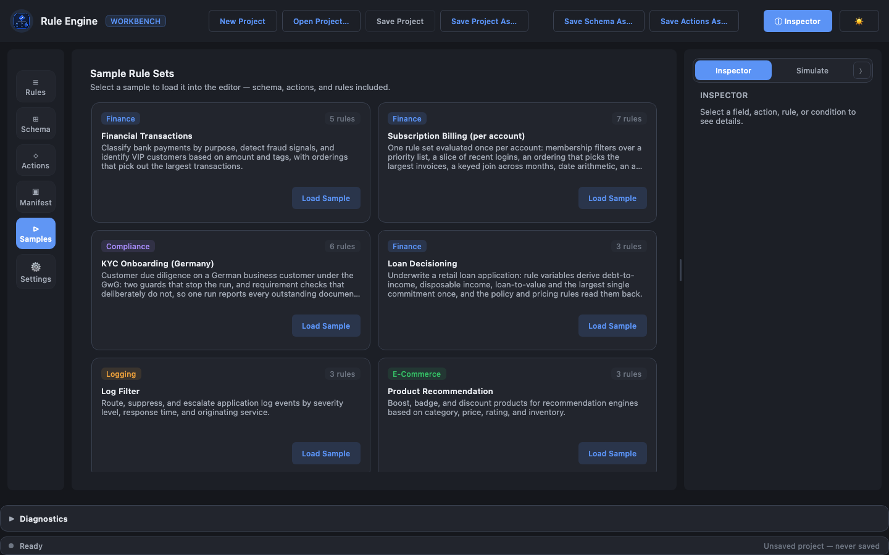
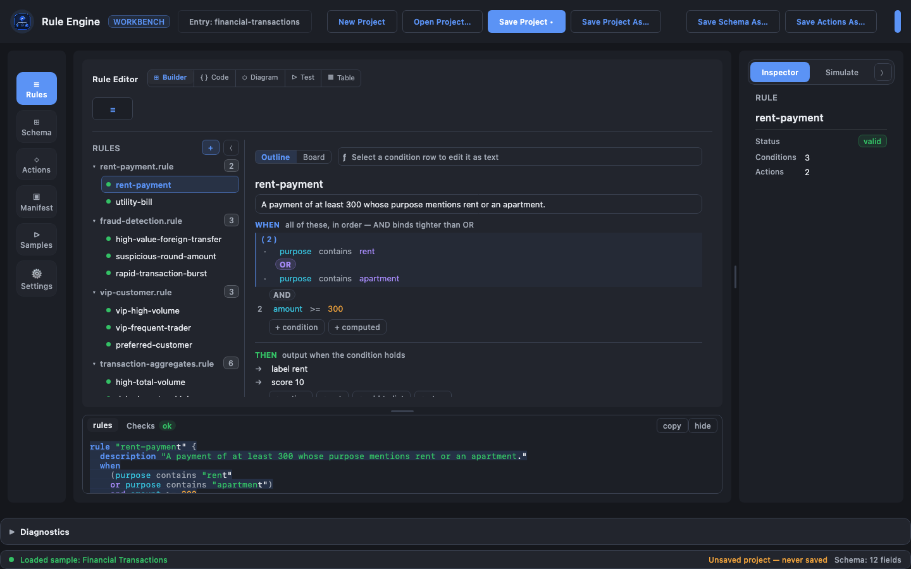
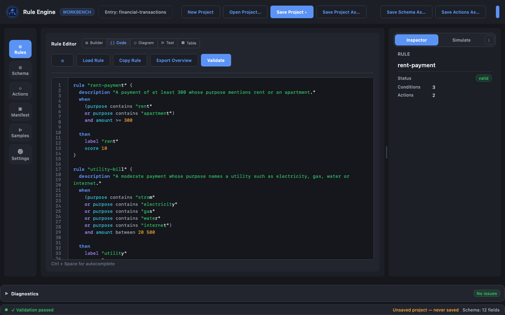
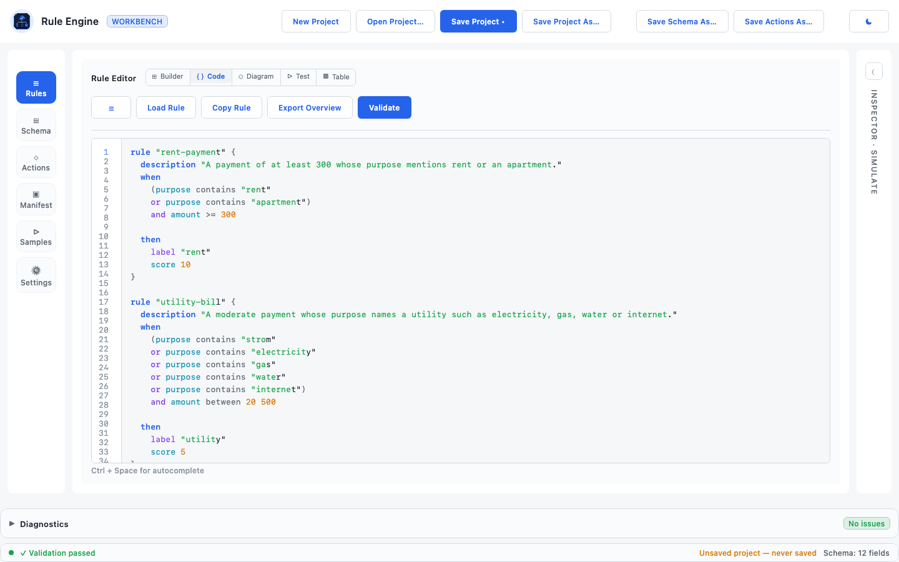
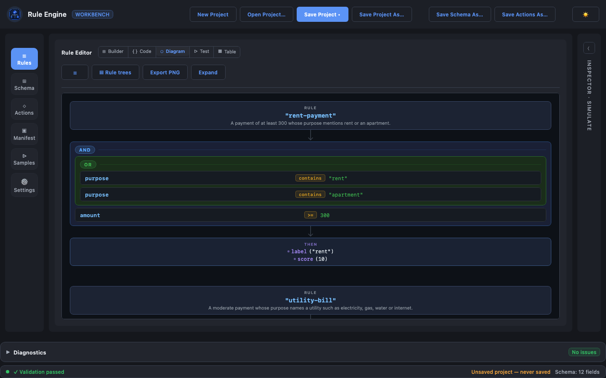
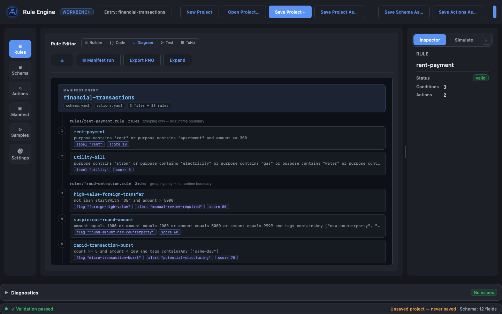

# Rule Engine — Visual Editor

The `ruleengine-ui` module is a Compose Desktop application for authoring rule projects: schema,
actions and rules, with validation and evaluation against sample input.

Rules stay plain `.rule` text at all times. The editor reads and writes the same files you would write
by hand, so switching between the visual builder and the code view is lossless.

---

## Running it

From the project root:

```bash
./gradlew :ruleengine-ui:run
```

Run the tests:

```bash
./gradlew :ruleengine-core:test :ruleengine-ui:jvmTest
```

Build everything:

```bash
./gradlew build
```

---

## What it looks like

The sample gallery — every bundled project, loadable without touching the file system:



The rule builder, with the `financial-transactions` sample open: rule tree on the left, the selected
rule's WHEN conditions on the right.



The same rules in the code view — plain `.rule` text, syntax highlighted. The whole editor comes in a
dark and a light palette, switched with the ☀ / ☾ button in the top bar:





The **rule trees** diagram, one condition tree per rule:



The **manifest run** diagram — the whole entry on one spine, in evaluation order:



These are rendered off-screen from the real app by `DocScreenshotsTest`, which is skipped unless asked
for:

```bash
./gradlew :ruleengine-ui:jvmTest -PdocScreenshots=true --tests '*DocScreenshotsTest*'
```

---

## What the editor gives you

| Area | What you can do |
|---|---|
| **Sample gallery** | Open a ready-made project — financial transactions, KYC onboarding, loan decisioning, log filter, product recommendation, access control, warehouse shipments — without touching the file system. Each carries its own manifest, so the diagram views work straight away |
| **Schema editor** | Edit fields as a table or as YAML, including nested `collection` / `object` members as indented child rows |
| **Rule builder** | Build conditions visually: field/operator/value rows, AND/OR grouping, `not`, `ignoreCase`, and aggregate or arithmetic operands. The THEN block holds action rows and `set` rows; an optional ELSE block holds the same for a false condition, and an optional NOT EXISTS block for a condition the record carries no data to decide |
| **Code view** | Edit the DSL directly, with syntax highlighting, autocompletion and inline diagnostics |
| **Diagram view** | Four diagrams over the same rules, picked in the toolbar: the **rule trees** (each rule's condition tree), the **manifest run** (the whole entry on one spine, in evaluation order), the **outcome map** (rules grouped by the output they produce, from any branch) and the **field flow** (schema field → rule → outcome, with the fields no rule reads) |
| **Table view** | Scan all loaded rules, their conditions and their actions at a glance |
| **Test panel** | Evaluate the rule set against JSON input: every variable the run published and every action it emitted, both grouped by the rule responsible, plus one row per rule — matched, else, not exists, partial, no match, or not evaluated — whose condition trace expands on click |

### Advanced conditions in the builder

A condition row is `operand · operator · operand`. Each operand is a chip that can be a field, a
literal value, an aggregate, a calculation, or a function call:

- **Aggregate** — pick a reduction (`count`, `sum`, `avg`, `median`, `max`, `min`, `subtract`) and build
  the path one segment at a time, attaching `where` filters to any segment.
- **Calculation** — a flat list of terms joined by `+`, `-`, `*`, `/`, with optional parentheses.
- **Function** — any other call the engine knows (`abs`, `daysBetween`, `every`, `any`, `sumByKey`),
  with one row per argument. An argument is an operand in its own right, so
  `abs(sum(invoices.amount) - sum(payments.amount))` is a function around a calculation around two
  aggregates, each editable in place.

Computed operands are numeric, so those kinds are offered only when the comparison can be numeric —
a text field will not let you build a sum against it. Rows carrying a computed operand are marked
with an accent stripe and show the DSL they generate underneath.

**Path segments** carry two things beyond their name, both edited in the segment's drawer and both
badged on the pill so they are visible while it is closed:

- a **where** filter, `and`-joined when there is more than one. `in` takes either a written-out list
  (`paid, sent`) or the name of another field or list variable (`priorityCustomerIds`) — a bare name
  is emitted unquoted, so it stays a membership test rather than becoming a text comparison.
- a **first / last n** bound, which is what `take` and `takeLast` generate. It applies where it sits
  relative to the filters above it, because the order is the meaning: `take(orders, 3)[paid == true]`
  selects paid orders among the first three, while `take(orders[paid == true], 3)` selects the first
  three paid orders.

### Variables in the builder

A rule can publish a value for the rules after it with a `set` clause. **+ Variable** in the THEN
block adds a `set name = operand` row, whose right-hand side is the same operand chip a condition row
uses — so a variable can hold a field, a literal, an aggregate or a calculation.

Variables that are in scope at the rule you are editing appear in the operand pickers as `$name`,
alongside the schema fields. "In scope" follows the engine: only variables published by a rule
*earlier* in the manifest's rule order are offered, so the builder cannot produce a forward reference.
The code view offers the same names through autocompletion, plus the `set` keyword itself.

The rule inspector lists what the selected rule publishes, and the test panel shows the value each
variable actually took for the input you ran.

Only `extract` clauses are still code-only; a rule using one — in either branch — opens read-only in
the builder with an explanation.

### The else branch in the builder

A rule can say what to produce when its condition is false. **+ Else branch** under the THEN card adds
the block and its first action; from then on the ELSE card behaves exactly like THEN, with its own
**+ Action** and **+ Variable** buttons and the same row editors.

Removing the last row from the ELSE card drops the branch and the button comes back. That is deliberate
rather than a separate toggle: an empty `else` does not parse, so "the block exists" and "the block has
something in it" are the same state in the DSL, and the builder keeps them the same state too.

The test panel reports an else result as its own **else** status, in its own filter and count — never as
"matched", because the rule's condition was false. The rule inspector shows an *Else actions* row for a
rule that has one, and the table view prefixes the else outputs with `else` so they do not read as
outputs the rule produces at the same time as its THEN ones.

### Validating a whole project

With a manifest open, **Validate** checks the entire entry rather than the file on screen — every rule
file, in manifest order, exactly as the engine loads it. That is what catches the problems a single file
cannot show: a rule id repeated in another file, and a `$variable` that resolves only because an earlier
file publishes it.

Each row in the diagnostics panel names the file it came from when that is not the one you are looking
at, and clicking it opens that file at the line. Underlines in the editor only ever come from the open
file: another file's line 12 is not this file's line 12.

While you type, the faster per-file pass keeps running on the open buffer, and it counts the variables
the earlier files of the entry publish — so a rule that reads one is not reported as broken between
keystrokes either.

### The not-exists branch in the builder

A rule can also say what to produce when the record carries no data to decide its condition — an absent
field, a `null`, a variable no earlier rule published. **+ Not-exists branch** adds the block and its
first action, and the NOT EXISTS card then behaves exactly like THEN and ELSE.

The cards are ordered THEN, ELSE, NOT EXISTS, which is the order the DSL requires: the generated text
writes `not_exists` after `else`, so a rule edited in the builder always parses back. Dropping the last
row drops the branch, the same way it does for ELSE.

The test panel reports it as its own **not exists** status, in its own filter and count, coloured orange
rather than green — the rule produced output, but without deciding. Its condition trace marks the
undecided rows orange too, so a run can be read back to the field that was not there. The rule inspector
shows a *Not-exists actions* row, and the table view prefixes those outputs with `not_exists`.

### Branches in the outcome map

The outcome map groups rules by the value they can decide, and it counts **every** branch: a rule that
produces `assessment "RED"` from its `else` sits in the same bucket as one that produces it from its
`then`, with a small `else` or `not_exists` badge saying where it came from. A `then` entry carries no
badge, which is the common case.

That matters because the bucket's own claim is a count — "2 rules can decide this" is a warning that a
record could pick the value up twice, or that two rules disagree. Reading only `then` blocks, as this
view used to, made that count wrong wherever an `else` decided the same value. A rule reaching one bucket
from two of *its own* branches still counts once: only one branch of a rule ever runs.

### Ending the run in the builder

A branch can end the run with `stop`: the rules after it are not evaluated at all. **+ Stop** on a branch
card adds it, and it then shows as a removable badge at the end of that branch — never as an editable row,
because there is nothing about a `stop` to edit.

The badge is always last, and stays last: the builder holds it as a flag on the branch rather than as an
entry in the action list, so adding more actions or variables afterwards cannot push output below it. The
generated DSL always writes `stop` as the block's final statement, which is what the parser requires.
**+ Stop** disappears while a branch already has one.

The test panel shows the consequence directly: rules after the halt are reported as **not evaluated**
rather than as *no match* — the run never tested them.

---

## Embedding the core yourself

The UI is a thin layer over `ruleengine-core`. The same entry points are available to any application:

| Step | Call |
|---|---|
| Load a field schema | `FieldSchemaLoader.loadFromString(content, nameHint)` |
| Load an action schema | `ActionSchemaLoader.loadFromString(content)` |
| Parse rules | `Parser(input = rulesText).parseRules()` |
| Validate | `Validator.validate(asts, schema, actions)` |
| Compile | `Compiler.compileRules(asts, schema)` |
| Load a whole project | `ManifestLoader` |

See the [Integration Guide](docs/integration-guide.md) for the full API, error handling and tracing.
